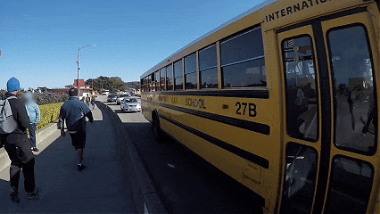
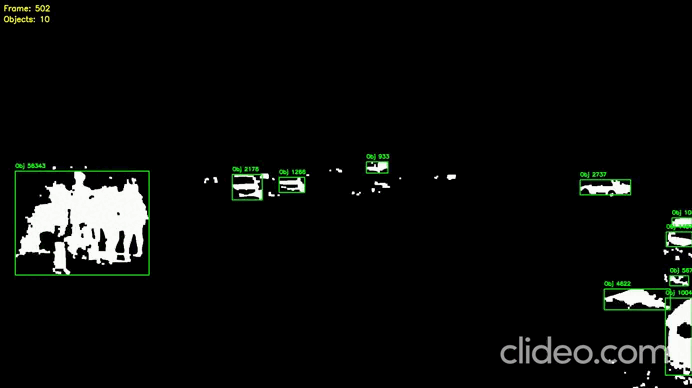

# DeepStream 8 Background Subtractor + NVIDIA Object Detection

This project demonstrates a **NVIDIA DeepStream 8** pipeline that simultaneously performs:

* object detection using **nvinfer**;
* moving-object extraction using **OpenCV Background Subtractor**;
* publishing the results as two independent RTSP streams.

The application receives an RTSP video stream as input and produces two separate RTSP outputs:

* **RTSP #1** — video processed by Background Subtractor;
* **RTSP #2** — video processed by standard NVIDIA DeepStream object detection (`nvinfer`).

---

## Features

* 🎥 RTSP input
* 🚶 Moving object extraction using BackgroundSubtractorMOG2
* 🧠 NVIDIA DeepStream object detection
* 📡 Two independent RTSP output streams
* ⚡ GPU-accelerated inference
* 🐳 Docker-based environment
* 🧩 Modular project structure

---

## Results

<p align="center">
  
</p>
---
<p align="center">
  
</p>
---

## Technology Stack

* NVIDIA DeepStream 8.0
* TensorRT
* GStreamer
* OpenCV
* BackgroundSubtractorMOG2
* Python
* RTSP
* Docker

---

# Environment

The project is designed to run inside the official NVIDIA DeepStream Docker container.

Start the container using:

```bash
docker run --gpus all -it --rm \\
    --network=host \\
    --privileged \\
    nvcr.io/nvidia/deepstream:8.0-gc-triton-devel
```

---

# Project Base

The project is based on the official NVIDIA DeepStream Python Applications repository:

https://github.com/NVIDIA-AI-IOT/deepstream_python_apps/tree/v1.2.2

The original NVIDIA example was refactored into a modular application with separated pipeline, source management, RTSP server, probe logic, configuration, and argument parsing.

---

# Background Subtractor

The first processing branch uses **OpenCV BackgroundSubtractorMOG2**, which extracts moving objects relative to a static background.

The processed video is published as a dedicated RTSP stream.

This branch can be used for:

* motion analysis;
* intrusion detection;
* scene-change detection;
* video surveillance preprocessing.

---

# NVIDIA Object Detection

The second processing branch uses the standard DeepStream **nvinfer** element to perform neural-network object detection on the GPU.

The resulting video with bounding boxes is published as a second RTSP stream.

---

# Pipeline

```
                 RTSP Camera
                      │
                      ▼
               uridecodebin
                      │
               nvstreammux
                      │
             ┌────────┴────────┐
             │                 │
             ▼                 ▼
     Background MOG2      nvinfer
             │                 │
             ▼                 ▼
        RTSP Server #1    RTSP Server #2
```


---

# Running

Example:

```bash
python3 main.py \\
    -i rtsp://127.0.0.1:8554/fire
```

---

# Output RTSP Streams

After startup, two independent streams become available.

### Background Subtractor

```
rtsp://localhost:8555/background
```

### NVIDIA Detection

```
rtsp://localhost:8556/detection
```

(Ports and mount points can be changed in the source code.)

---

# How It Works

After the application starts:

1. it connects to the RTSP camera;
2. the video stream is decoded using DeepStream;
3. the stream is split into two processing branches;
4. the first branch applies BackgroundSubtractorMOG2;
5. the second branch performs TensorRT inference through `nvinfer`;
6. each branch is published through its own RTSP server.

This allows a single camera stream to be analyzed by two different computer-vision algorithms simultaneously without reconnecting to the camera.

---

# Command Line Arguments

| Argument    | Description                                     |
| ----------- | ----------------------------------------------- |
| `-i`        | Input RTSP stream                               |
| `-g`        | Inference backend (`nvinfer` / `nvinferserver`) |
| `-c`        | Output codec (`H264` / `H265`)                  |
| `-b`        | Encoder bitrate                                 |
| `--rtsp-ts` | Use RTSP timestamps                             |

---

# Project Capabilities

* receives one or more RTSP streams;
* extracts moving objects using OpenCV;
* performs GPU-accelerated object detection;
* publishes two independent RTSP streams;
* supports H.264 and H.265 encoding;
* supports DeepStream batch processing;
* supports RTSP timestamp synchronization.

---

# Notes

The TensorRT engine is generated automatically during the first application launch if no serialized engine is found.

Subsequent launches reuse the generated engine for significantly faster startup.

---

# Acknowledgements

* NVIDIA DeepStream SDK
* NVIDIA DeepStream Python Apps
* OpenCV
* GStreamer

